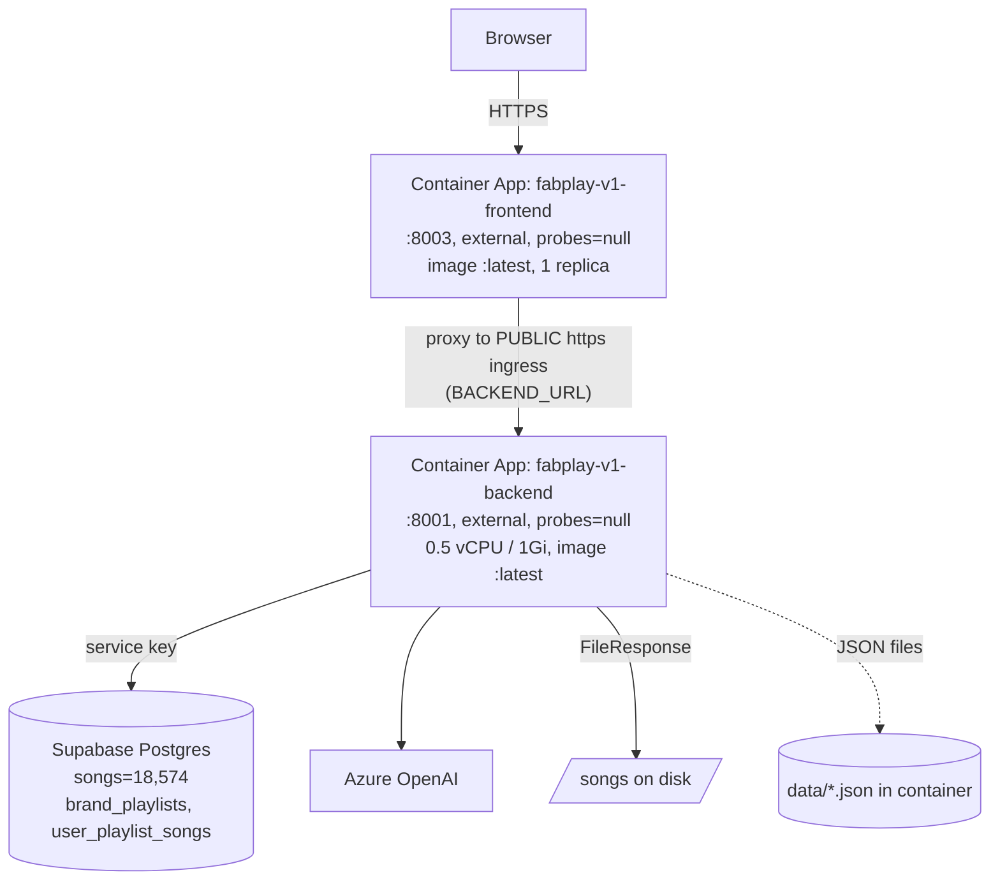

# fabplay-v1 — Current State (The Problems)

**Branch**: `fabplay-v1`
**Date**: 2026-05-29
**Method**: Read-only. Code via `git show fabplay-v1:<path>`. **Live data verified** against the production Supabase project (`iruimptvnjrpmgtebjzq`, from `.env`) and the **live Azure deployment** (`fabplay-v1-rg`, Azure Container Apps) via `az`/REST. Secrets are never reproduced here.
**Companion**: `TARGET_STATE.md` (how each of these should look).

Severity: **CRITICAL** (broken/data-loss/exploitable) · **HIGH** (wrong under realistic use) · **MEDIUM** (works, costs maintenance/UX) · **LOW** (polish). Confidence: **Confirmed** (quoted code or live data) · **Likely** · **Suspected**.

---

## 0. What v1 actually is (verified topology)

v1 is **two independent FastAPI services deployed as two separate Azure Container Apps**, both with public ingress, backed by one Supabase Postgres (18,574 songs) and Azure OpenAI.



Verified facts (live `az`): both apps have **`probes: null`** (no health/readiness gating); **backend ingress is `external: true`** (publicly reachable, not internal-only); frontend `BACKEND_URL = https://fabplay-v1-backend.orangedune-…azurecontainerapps.io` (proxies over the public internet); images are mutable `:latest`; backend is `0.5 vCPU / 1Gi`, min=max=1 replica; all secrets are **inline plaintext env values** (not Container App secrets / Key Vault).

> Note: the repo's `docker-compose.yml` (internal `http://backend:8001`, `depends_on`) is **not** how this is deployed. Production is two Container Apps and the compose file is dead/misleading.

---

## 1. Architecture

**Current state**: Two FastAPI processes. Backend (`backend/api.py`, 1,632 lines) is the real API + serves audio. Frontend (`frontend/server.py`, 113 lines) is a static-file server + dumb reverse proxy that forwards `Authorization` through to the backend. Persistence is split-brain: brands/playlists in **container-local JSON** (`data/*.json`) and partially mirrored to Supabase.

**Problems**

- **[HIGH · Confirmed] The frontend tier is a pure liability.** It adds a second public Container App, a network hop *over the public internet* (`BACKEND_URL` is the backend's external FQDN), and a failure mode — for zero functional value. Its only "auth" is a cosmetic cookie check it disclaims:
  ```python
  # frontend/server.py:47-50
  # Server-side guard: redirect to /login if no session cookie present.
  # The real security is enforced by the API's JWT check on every request.
  if not request.cookies.get("fabplay_session"):
      return RedirectResponse("/login", status_code=302)
  ```
- **[HIGH · Confirmed] Split-brain persistence with no durable source of truth.** Brands live only in container-local JSON behind no volume on Container Apps (the compose volume isn't used in the live deploy), and `_load` silently returns empty on any read error:
  ```python
  # backend/api.py:184
  except Exception:
      return default   # corrupt/missing store → brands silently become {}
  ```
  Playlists are luckier — mirrored to `brand_playlists.playlist_json` (verified: 211 rows live) — but brands are not.
- **[MEDIUM · Confirmed] Dead embedding/pgvector subsystem shipped.** `embed_client()` (`api.py:273`), `search_by_embedding`/`upsert_embeddings`/`fetch_songs_not_yet_embedded` (`db.py`), and `pipeline/embed_utils.py` exist but the live retriever (`rag_retriever.retrieve_candidates`) never calls vector search — it sorts by `compute_relevance`. The four `AZURE_OPENAI_EMBED_*` env vars are wired but unused at runtime.

---

## 2. Pipeline & Deployment

**Current state**: Two Dockerfiles → two images in ACR `fabplayv1acr69360.azurecr.io` (`fabplay-backend:latest`, `fabplay-frontend:latest`) → two Azure Container Apps in `fabplay-v1-rg`.

### ★ Boot-order bug — root cause (CRITICAL · Confirmed against live Azure)

> **Symptom**: on first start, frontend is up but backend is "down"; works on the second start.

Three compounding causes, all now verified against the live deployment:

1. **No readiness gating anywhere.** Both Container Apps have **`probes: null`** (verified via `az containerapp show`). Azure routes traffic the moment the TCP port opens, and the two apps have **no ordering dependency** (Container Apps has no `depends_on`). The light frontend (`fastapi`+`httpx` only) is ready in ~1s; the heavy backend is not.
2. **The proxy fails the first request with no retry.**
   ```python
   # frontend/server.py:69-76  — no try/except, no retry, no backoff
   async with httpx.AsyncClient(timeout=120.0) as client:
       resp = await client.request(method=request.method, url=url, ...)
   ```
   While the backend is still importing/loading, this raises `ConnectError`/times out → error to the user. "Frontend up, backend down."
3. **Backend cold-start is genuinely slow on 0.5 vCPU / 1Gi.** It imports `numpy`, `supabase`, `openai`, `PyMuPDF`, then the **first request loads all 18,574 songs into memory** (`fetch_all_songs`, 300s cache) and runs numpy MMR — heavy for half a core. It loses the race; on the second start it's warm and cached.

**Latent (not the live trigger)**: `db.py:34-37` does `sys.exit(1)` if Supabase env is missing — a process-killing crash. In the live deploy env vars are inline so this doesn't fire, but it remains a boot-fragility landmine.

### Other deployment problems

- **[HIGH · Confirmed] Mutable `:latest` image tags.** Both Container Apps run `…:latest`. No immutable digests → no reliable rollback, "works on my machine" drift, and a redeploy can silently change the running code.
- **[HIGH · Confirmed] `docker-compose.yml` is deployment fiction.** It describes internal networking + `depends_on` that the real Azure deploy does not use. Anyone trusting it will mis-debug the boot issue.
- **[MEDIUM · Confirmed] Unpinned base image** `python:3.12-slim` (`Dockerfile.backend:1`) and `PyMuPDF` installed in a second `pip` layer (`Dockerfile.backend:9`) instead of `requirements.txt` — non-reproducible builds.
- **[MEDIUM · Confirmed] Containers run as root** — neither Dockerfile creates a non-root user.
- **[LOW · Confirmed] No CI/CD in repo** — no workflow files; deploys appear manual (`DEPLOYED_AT`/`BUILD_TAG` env stamps suggest a hand-run script).

---

## 3. Data Model

**Current state (verified live)**: One Supabase Postgres. Key table `songs` (18,574 rows) with columns:
`id, title, artist, url, filename, tempo_bpm, key_signature, duration_seconds, energy, danceability, loudness, acousticness, instrumentalness, onset_rate, speechness, genre, genre_probabilities, valence, arousal, mood_predicted_labels, mood_top_labels, mood_probabilities, created_at, song_type`. Plus `brand_playlists` (211 rows, full `playlist_json` snapshots), `user_playlist_songs` (flat id list), `song_embeddings`, `user_roles`.

### ★ Genre bug — TRUE root cause (CRITICAL · Confirmed against live data)

> **Symptom**: the website shows a genre (e.g. "electronic") that is totally different from the real genre (e.g. jazz/classical).

I traced the full path **and verified against live data** — and the earlier "frontend `_fmtGenre`" explanation was wrong/secondary. The real cause is **the `songs.genre` column is mislabeled data**. The website renders it faithfully.

**Evidence 1 — the website matches the DB exactly.** For a live 315-track playlist (`brand_playlists`), every stored track genre equals the current `songs.genre`:
```
unique songs in playlist = 315   stored_vs_live_mismatches = 0
```
So there is **no** snapshot drift and **no** misjoin. `get_playlist` (`api.py:1454`) returns the `playlist_json` snapshot, whose `genre` came from `_fmt_track`'s `t.get("genre")` (`api.py:290`), which came from `songs.genre`. The chain is faithful.

**Evidence 2 — the `songs.genre` column itself is garbage.** Comparing the catalog folder in each song's CloudFront `url` (the real/intended genre) against the `genre` column, over a 600-song sample:

| Folder (real genre) | n | `songs.genre` distribution |
|---|---|---|
| **JAZZ** | 498 | **electronic 359 (72%)**, jazz 76 (15%), hip_hop 22, rock 19 |
| **HIP_HOP** | 7 | christmas 4, pop 3 — **zero hip_hop** |
| **CLASSICAL** | 4 | other 2, chillout 1, lounge 1 — **zero classical** |
| **POP** | 45 | rock 11, electronic 10, indian classical 6, house 5 |
| **EDM** | 34 | electronic 30, chillout 2, indie 1 |
| **ROCK** | 9 | rock 7, country 1, electronic 1 |

The exact track the symptom describes:
```
id=67151  title="Yearning"  genre="electronic"  song_type="vocal"
url=.../songs/JAZZ/AMU-624-1136-Yearning.mp3   genre_probabilities=None
```
A JAZZ-folder track labeled `electronic`, with `genre_probabilities=NULL`. The `genre` column is the output of a **genre-classifier / ingestion step that is grossly inaccurate** (≈72% of jazz mislabeled as electronic) — and there are parallel columns (`genre_probabilities`, `mood_predicted_labels`, `mood_top_labels`) that confirm this is an ML pipeline, not curated metadata.

**Why this is CRITICAL, not cosmetic**: every genre feature is built on this bad column — `/api/catalog/genres` (`api.py:1078`), the brand "include/exclude genres" filtering, and `fetch_must_include_genre_tracks`. A brand asking for "jazz" gets the ~15% of jazz tracks the classifier happened to label jazz, plus mislabeled noise. Genre-based curation is fundamentally unreliable.

### Other data-model problems

- **[HIGH · Confirmed] No schema-as-code.** No migrations/SQL in the repo; the schema exists only in the live DB. Columns are discovered at runtime via `dict.get`. Confidence in structure is zero without live access.
- **[MEDIUM · Confirmed] Column typo `speechness`** (should be `speechiness`) is the real DB column (verified) and is read as `speechness` then re-emitted as `speechiness` in `_fmt_track` (`api.py:290` block) — a permanent rename trap.
- **[MEDIUM · Confirmed] Magic normalization constants** assume DB ranges: `energy/0.15`, `valence/9.0` (`db.py` `_normalize`). If ingestion ranges change, all targeting silently skews.
- **[MEDIUM · Confirmed] Business rule baked into the data layer**: `_EXCLUDED_GENRES = {"christian devotional"}` (`db.py:26`) filters on the (unreliable) genre column.
- **[LOW · Confirmed] `user_playlist_songs` stores no genre/features** — only `{user_id, brand_id, song_id, song_name, generated_at}` (`api.py:700-740`); it can't reconstruct a playlist, so `brand_playlists.playlist_json` is the only real persistence.

---

## 4. Code Structure

**Current state**: `backend/api.py` is a 1,632-line god-module (~58 `def`s) holding auth, JSON persistence, an in-memory task registry, Azure helpers, formatters, two background pipelines, and ~30 routes.

**Problems**

- **[HIGH · Confirmed] Single-responsibility collapse.** `_bg_playlist` (`api.py:537-758`, ~220 lines) does profile gen, soundboard gen, genre-override merge (nested closure `_apply_genre_overrides` at `api.py:547`), per-day-part retrieval, dedup, MMR, JSON save, two Supabase syncs, and brand bookkeeping.
- **[HIGH · Confirmed] ~90 lines of near-verbatim duplication**: `analyze_assets_preview` (`api.py:898-993`) and `upload_assets` (`api.py:995-1071`) — identical PDF parse, image MIME ladder, and LLM prompts.
- **[MEDIUM · Confirmed] Playlist→Supabase sync written 3×** (`api.py:700-740`, `_sync_playlist_songs` at `api.py:1329`, used by `remove_tracks`/`replace_track`).
- **[MEDIUM · Confirmed] Ownership check copy-pasted in ~8 endpoints** instead of a dependency.
- **[LOW · Confirmed] In-function re-imports** of already-imported modules (`api.py:962,1076,1418`; `db.py:135,179`).

---

## 5. Code Implementation

**Problems**

- **[HIGH · Confirmed] Errors masked as HTTP 200.** `catalog_genres` returns `{"genres": [], "error": str(e)}` with a 200 on DB failure (`api.py:1081`); same in `catalog_stats` (`api.py:1090`), `catalog_songs` (`api.py:1120`), `debug_songs` (`api.py:1488`). Clients can't detect failure by status.
- **[HIGH · Confirmed] Frontend silently masks the genre/data problem.** `loadCatalogGenres` swallows all errors (`catch(e){}`, `app.js:199`) and the `genres` getter falls back to a hardcoded list:
  ```javascript
  // app.js:102
  allGenres: ['Blues','Classical','Country','Electronic','Hip Hop','Jazz','Latin','Other','Pop','Reggae','Rock','Soul/Funk'],
  catalogGenres: [], // loaded from DB — falls back to allGenres if empty
  ```
  And `_fmtGenre` (`app.js:178-181`) re-cases DB values (`hip_hop`→`Hip Hop`) and dedupes on the formatted value (collapsing distinct genres). This is a **secondary** cosmetic bug layered on the real data problem (§3).
- **[MEDIUM · Confirmed] N+1 / repeated full-catalog loads.** `_bg_playlist` calls `retrieve_candidates` once per day-part (`api.py:582`), each loading the 18k-row catalog (`rag_retriever.py:166`); `replace_track` reloads the full catalog for a single swap (`api.py:1388`). Only the 300s cache saves it.
- **[MEDIUM · Confirmed] Shared-mutable cache corruption.** `fetch_all_songs` returns `list(_song_cache)` (shallow copy); MMR mutates the contained dicts (`chosen["mmr_score"]=…`), polluting the cached catalog across requests.
- **[LOW · Confirmed] Warnings used as debug prints** in normal flow (`api.py:586,612,628,1190`).

---

## 6. Dependencies

**Current state** (`requirements.txt`): `fastapi 0.115.0`, `uvicorn 0.32.0`, `watchfiles 1.1.1`, `openai 1.101.0`, `supabase 2.28.0`, `python-dotenv 1.0.1`, `httpx 0.27.2`, `pydantic 2.11.7`, `python-multipart 0.0.20`, `numpy 2.3.4`. `PyMuPDF 1.25.5` installed separately in the Dockerfile.

**Problems**

- **[HIGH · Confirmed] `PyMuPDF` is an undeclared dependency** — installed only in `Dockerfile.backend:9`, absent from `requirements.txt`. A non-Docker run or a fresh dev env breaks on `import fitz`.
- **[MEDIUM · Confirmed] `watchfiles` (dev hot-reload) shipped to production** — unnecessary in a `uvicorn … reload=False` container.
- **[MEDIUM · Confirmed] No dependency hashing / lockfile** — pins exist but no `pip` hashes or lock; transitive deps float. Not reproducible.
- **[LOW · Confirmed] `numpy 2.3.4` + `PyMuPDF` in 1Gi / 0.5 vCPU** is a heavy footprint for the box size, aggravating the cold-start race (§2).
- **[LOW · Suspected] Embedding deps unused** — the `openai` embedding client path is dead, so part of the dependency surface earns nothing.

---

## 7. Configuration & Secrets

**Current state (verified live)**: 18 backend env vars set as **inline plaintext values** on the Container App; only the ACR pull credential and `firecrawl-api-key` use Container App secrets. `.env` (gitignored, present locally) holds `SUPABASE_SERVICE_KEY`, `AZURE_OPENAI_API_KEY`, `SUPABASE_ANON_KEY`, etc.

**Problems**

- **[CRITICAL · Confirmed] Production secrets stored as plaintext env values.** `SUPABASE_SERVICE_KEY` (RLS-bypassing) and `AZURE_OPENAI_API_KEY` are readable by anyone with reader access via `az containerapp show … --query template.containers[0].env`. They are not in Container App secrets or Key Vault.
- **[CRITICAL · Confirmed] The RLS-bypassing service key is the app's only DB credential** (`db.py` `get_supabase()` uses `SUPABASE_SERVICE_KEY`), and it is also sent as the `apikey` when validating *user* tokens (`api.py:84-89`). Every query runs with full privileges; a single leak = full DB compromise.
- **[HIGH · Confirmed] `/api/config` serves credentials unauthenticated** (`api.py:1503`): returns `supabase_url` + `supabase_anon_key` to anyone — and since the backend ingress is **external**, it's reachable directly on the internet.
- **[MEDIUM · Confirmed] Config crash-on-missing**: `db.py:37 sys.exit(1)` kills the process if a var is absent (boot fragility, §2).
- **[MEDIUM · Confirmed] No config schema/validation** — vars are read ad-hoc via `os.getenv` with silent defaults scattered across modules.

---

## 8. Endpoints

**Current state**: ~30 routes on `backend/api.py`, fronted by the proxy. **Both the proxy and the backend are publicly reachable** (backend ingress `external: true`), so every backend route is exposed on the internet directly.

**Problems**

- **[CRITICAL · Confirmed] Path traversal in unauthenticated `/songs/{path}`** (`api.py:1493`): `file_path = SONGS_DIR / path`, no containment check, registered on `app` (no auth). `…/songs/../../../etc/passwd` is served. Directly reachable on the backend's public FQDN.
- **[CRITICAL · Confirmed] Broken object-level authorization (IDOR).** `get_playlist` (`api.py:1454`), `start_generate` (`api.py:1185`), `start_soundboard` (`api.py:1168`), `generation_status` (`api.py:1195`), `upload_assets` (`api.py:995`) check only for a valid JWT, never ownership. Any authenticated user reads/triggers any brand. Sibling endpoints *do* check `user_id`, proving the omission.
- **[HIGH · Confirmed] Open, auto-confirmed signup** (`api.py` ~1519) with `email_confirm:True`, no rate limit — unbounded account creation, exposed publicly.
- **[MEDIUM · Confirmed] No pagination** anywhere (only hardcoded caps: `catalog/songs` `limit(50)`, `iam/users` `per_page=1000`); bare-array responses (`/api/brands`, `/api/activity`).
- **[MEDIUM · Confirmed] Inconsistent error shapes**: `HTTPException {detail}` vs 200-with-`error`-key vs `JSONResponse {error}`.

---

## 9. UI

**Current state**: single Alpine.js component (`frontend/static/app.js`, 1,360 lines); all state in memory; token + per-brand genre overrides in `localStorage`; central `apiFetch()` wrapper.

**Problems**

- **[HIGH · Confirmed] The UI presents the bad genre data as truth** (§3/§5) with a hardcoded fallback that hides failures — users can't tell mislabeled data from a fetch error.
- **[MEDIUM · Confirmed] Pervasive silent error swallowing** (`async loadX(){try{…}catch(e){}}`, `app.js:174-177`); a failed `/api/init` bounces the user to `/login` regardless of cause (a network blip logs you out).
- **[MEDIUM · Confirmed] Unbounded polling** — soundboard/generation pollers loop forever with no max-attempts if status never resolves.
- **[LOW · Confirmed] CDN deps without SRI** (Tailwind/Alpine/Chart.js/GSAP in `index.html`); manual cache-bust `app.js?v=NN`.
- **[GOOD] No `console.log`/`debugger`** left in; API paths are relative; no keys in JS.

---

## 10. Verdict — current state

v1 **runs**, but it is a demo-grade, AI-generated patchwork whose most visible defect (genre) is actually a **data-quality failure** in the `songs.genre` column (≈72% of jazz mislabeled), faithfully surfaced by the UI — not a rendering bug. Around it sit **internet-exposed Critical security holes** (path traversal + IDOR on a publicly-reachable backend, plaintext service-role key), a **boot-order race** rooted in missing health probes on two unordered Container Apps plus a no-retry proxy, and **no durable source of truth** for brands.

**Issue register (current state)**

| ID | Severity | Effort | Finding | Evidence |
|----|----------|--------|---------|----------|
| C-1 | CRITICAL | M | `songs.genre` mislabeled (~72% jazz→electronic); all genre features built on it | live data §3 |
| C-2 | CRITICAL | S | Path traversal in unauth `/songs/{path}` on public backend | api.py:1493 |
| C-3 | CRITICAL | M | IDOR on get_playlist/generate/soundboard/status/assets (public backend) | api.py:1454,1185,1168,1195,995 |
| C-4 | CRITICAL | S | Service-role key as inline plaintext env + sole DB cred + used for user-token auth | az env, db.py, api.py:84 |
| C-5 | CRITICAL | M | Boot-order race: no probes on 2 unordered Container Apps + no-retry proxy + heavy cold start | az probes=null, server.py:69 |
| H-1 | HIGH | S | Brands only in container-local JSON; `_load` silently empties on error | api.py:165-197,184 |
| H-2 | HIGH | S | `/api/config` serves anon key unauthenticated on public backend | api.py:1503 |
| H-3 | HIGH | S | Open auto-confirmed signup, no rate limit | api.py:~1519 |
| H-4 | HIGH | S | Mutable `:latest` images; compose file is deployment fiction | az images, docker-compose.yml |
| H-5 | HIGH | S | Errors masked as HTTP 200 across catalog/debug | api.py:1081,1090,1120,1488 |
| H-6 | HIGH | M | `api.py` god-module (1632 lines); ~90-line duplicated asset handlers | api.py:898-1071 |
| H-7 | HIGH | S | Zero automated tests | (none) |
| H-8 | HIGH | S | PyMuPDF undeclared (Dockerfile-only dependency) | Dockerfile.backend:9 |
| M-1 | MEDIUM | M | N+1 full-catalog loads per day-part / per swap | api.py:582,1388 |
| M-2 | MEDIUM | S | Shared-mutable catalog cache corrupted by MMR | db.py + mmr_scorer |
| M-3 | MEDIUM | S | Dead embedding/pgvector subsystem + unused embed env/deps | api.py:273, db.py |
| M-4 | MEDIUM | S | `speechness` typo as real column; magic normalization constants | db.py |
| M-5 | MEDIUM | S | Frontend tier adds public hop for no value | server.py |
| M-6 | MEDIUM | S | No pagination; inconsistent error shapes; bare arrays | api.py |
| M-7 | MEDIUM | S | Runs as root; unpinned base image; watchfiles in prod | Dockerfile.backend |
| L-1 | LOW | S | UI silent error swallow + unbounded polling | app.js:174-177 |
| L-2 | LOW | S | CDN deps without SRI; manual cache-bust | index.html |
| L-3 | LOW | S | No CI/CD in repo (manual deploys) | repo |

**5 Critical · 8 High · 7 Medium · 3 Low.** See `TARGET_STATE.md` for what each should become.
