# fabplay — Target State (The Reference Platform)

**Scope**: the production platform fabplay *should* be — already serving 4 clients, so this is the system clients depend on, not a demo cleanup.
**Companion**: `CURRENT_STATE.md` (verified problems; IDs `C-1`…`L-3` referenced where a target closes a gap).
**Read it as**: standard → diagram → before/after → why, per section.

---

## Design principles (the contract every section obeys)

| # | Principle | What it forbids |
|---|-----------|-----------------|
| 1 | **One source of truth per fact** — brands, playlists, catalog, genre live in Postgres | JSON files, per-replica state |
| 2 | **Tenant isolation in the database** — RLS keyed to the org | "the app checks ownership" as the only guard |
| 3 | **Least privilege** — service-role key never on request paths; secrets in Key Vault | inline plaintext keys, service key for user auth |
| 4 | **Provenance over guesses** — every derived value records *how* + *confidence* | shipping a classifier's wrong genre as truth |
| 5 | **Closed-loop deploys** — digest-pinned, probe-gated, one-command rollback | `:latest`, click-ops, cold-start routing |
| 6 | **Observable by default** — logs, traces, metrics, per-tenant SLOs | finding out from a client email |

---

## 0. Target topology

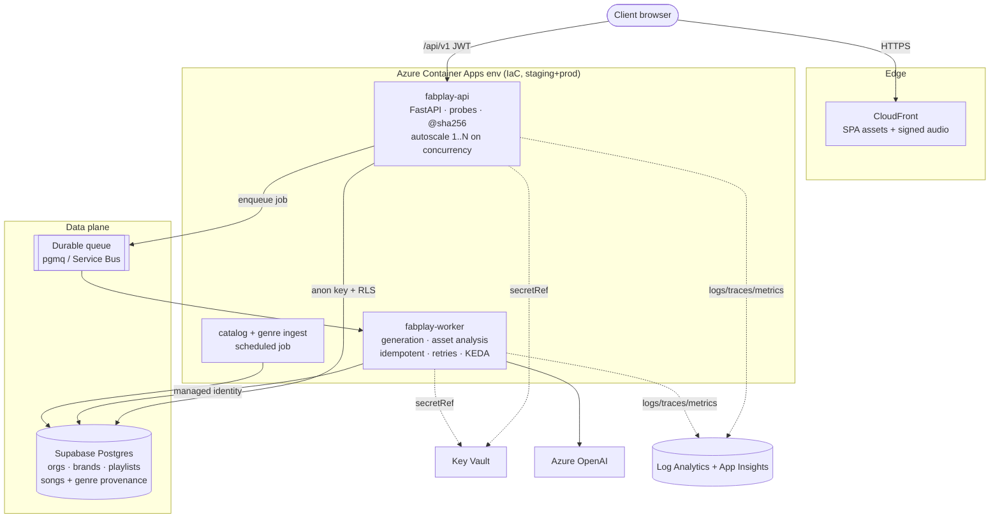

**Why split API / worker / ingest**: generation and multi-file Azure OpenAI analysis are slow and bursty — today they run as raw `threading.Thread` inside the web process (`api.py:1191`). Moving them to a queue-backed worker keeps the API responsive, lets generation survive deploys, and stops one stuck job from freezing a client's dashboard.

---

## 1. Architecture

**Standard**: stateless, multi-tenant API + async worker, Postgres-backed, CDN-fronted. Strict layering; domain logic (brand profiling, soundboard, RAG, MMR) is framework-free and unit-testable.

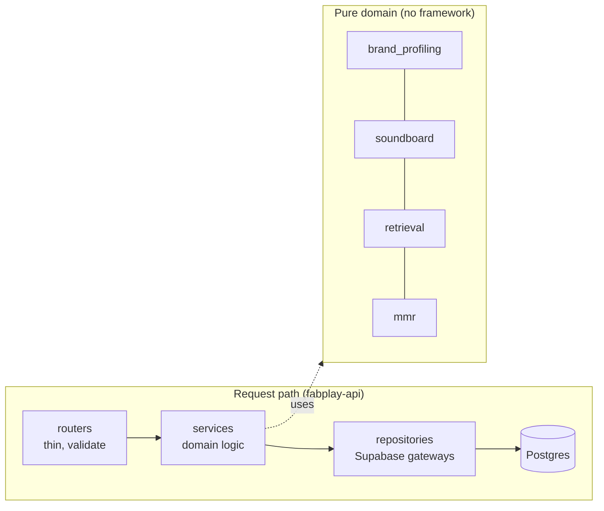

**Before → After**

| Aspect | v1 today | Target |
|---|---|---|
| Tiers | 2 public Container Apps (proxy + backend) | 1 API (CDN-fronted) + 1 worker |
| State | container-local `data/*.json` | Postgres only (stateless app) |
| Heavy work | `threading.Thread` in web process | durable queue + worker |
| Tenancy | `brand.user_id` checked in code | `org_id` + RLS in the DB |
| Module | `api.py` 1,632 lines | `routers/services/repositories/domain` |

**Why** (closes M-5, H-1, M-3, H-6): removes the dead proxy hop, scales horizontally for more clients, isolates bursty work, and gives the 4 clients hard, DB-enforced data boundaries.

---

## 2. Pipeline & Deployment

**Standard**: reproducible from git. IaC describes infra; CI builds once → immutable digest; rollout is canary + probe-gated; rollback is one command.

**CI/CD flow**
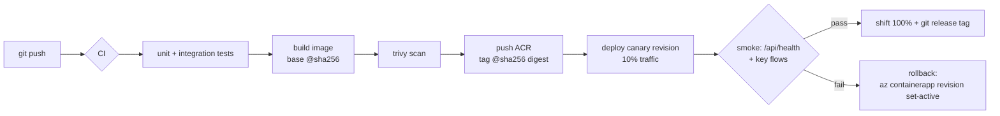

**Probe-gated startup — the fix for the boot-order bug (C-5)**
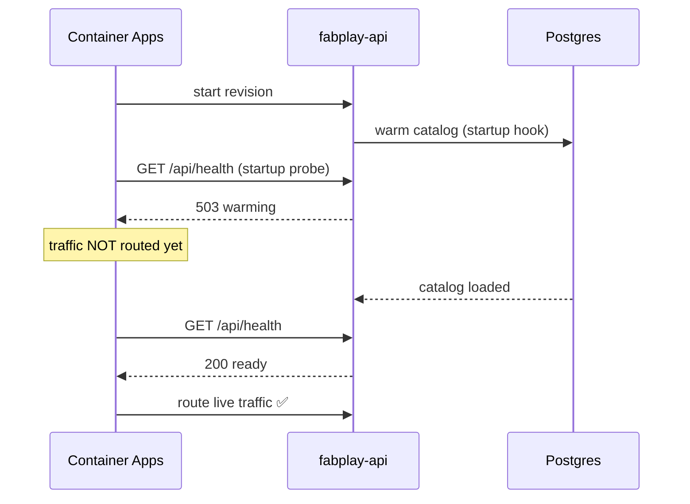

**Before → After**

| | v1 today (verified via `az`) | Target |
|---|---|---|
| Probes | `probes: null` on both apps | startup + readiness + liveness on `/api/health` |
| Ordering | 2 unordered apps, frontend wins race | single app, traffic gated on readiness |
| Images | mutable `:latest` | immutable `@sha256` digests |
| Rollout | manual redeploy | canary 10% → smoke → 100% |
| Rollback | none | revision set-active (seconds) |
| Infra | hand-built, `docker-compose.yml` is fiction | Bicep/Terraform, staging≡prod |
| Sizing | 0.5 vCPU / 1Gi | ≥1 vCPU / 2Gi API; worker scales on queue depth (KEDA) |

**Why**: a 4-client platform must never route to a cold backend and must be able to roll back instantly. Probes turn "works on the second start" into "never serves an unready revision."

---

## 3. Data Model — including the genre system

**Standard**: normalized, multi-tenant, migration-versioned, provenance on every derived field.

**Entity model**
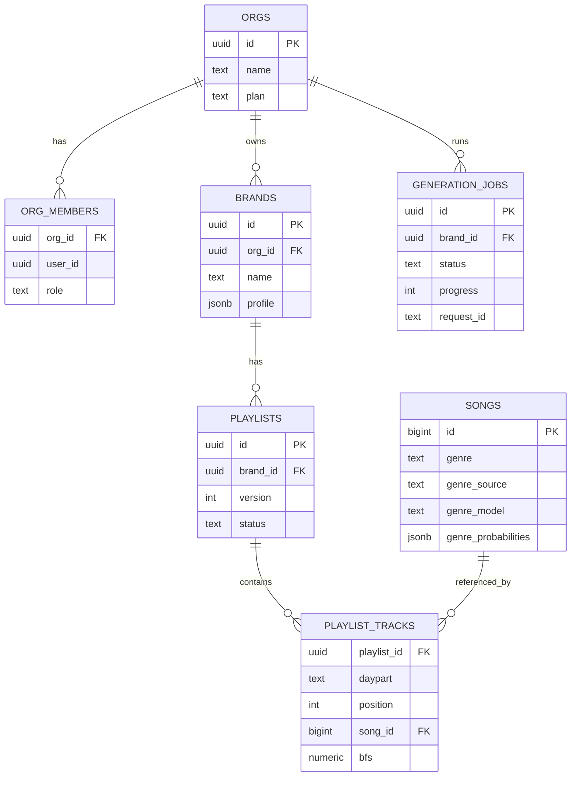

**The genre source-of-truth — the headline fix (C-1)**

Verified problem: `songs.genre` is unreliable classifier output. The CloudFront folder is the real genre.

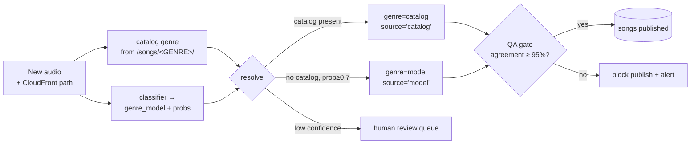

Provenance columns + backfill:
```sql
alter table songs add column genre_source text;   -- 'catalog' | 'human' | 'model'
alter table songs add column genre_model  text;   -- raw classifier label, never displayed
-- songs.genre := authoritative; genre_probabilities (exists) kept for QA

-- backfill 18,574 rows from the folder (ground truth); map EDM→electronic via vocab table
update songs
set genre = lower(split_part(split_part(url,'/songs/',2),'/',1)),
    genre_source = 'catalog'
where url like '%/songs/%';
```

**Before → After (genre)**

| | v1 today | Target |
|---|---|---|
| `genre` value | classifier output (JAZZ→"electronic" 72%) | catalog folder = truth |
| Model output | overwrites truth | kept in `genre_model`, confidence-gated |
| Detectability | none (silent) | QA gate ≥95% + provenance |
| Playlists | one opaque `playlist_json` blob | relational `playlist_tracks`, versioned |
| Schema | only in prod DB | migrations-as-code in git |

**Integrity & perf**: RLS on every tenant table (§7); indexes `songs(genre)`, `songs(energy,valence,tempo_bpm)`, `playlist_tracks(playlist_id)`, `brands(org_id)`; fix `speechness`→`speechiness` via migration (M-4); move `_EXCLUDED_GENRES` to config.

---

## 4. Code Structure

**Standard**: clean/hexagonal; no module over a few hundred lines, no function over ~50; cross-cutting concerns as deps/middleware.

```
app/
├── routers/        auth orgs brands catalog playlists generation iam   (thin: validate → call service)
├── services/       brand_profiling soundboard retrieval mmr generation (pure domain)
├── repositories/   songs brands playlists jobs                          (Supabase gateways)
├── workers/        generate analyze_assets build_soundboard            (queue handlers)
├── core/           settings · auth deps (require_org_member, require_brand_owner) · error envelope
└── domain/         Brand Soundboard DayPart Track Candidate             (dataclasses)
```

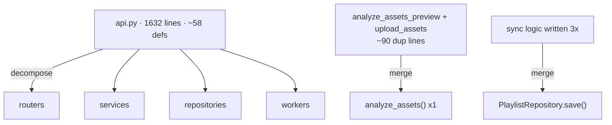

**Why** (closes H-6): changes become local and safe; MMR/RAG/soundboard become testable without the web app.

---

## 5. Code Implementation

**Standard**: correct HTTP semantics, no swallowed errors, idempotent observable jobs, immutable shared data.

**Generation as a durable job**
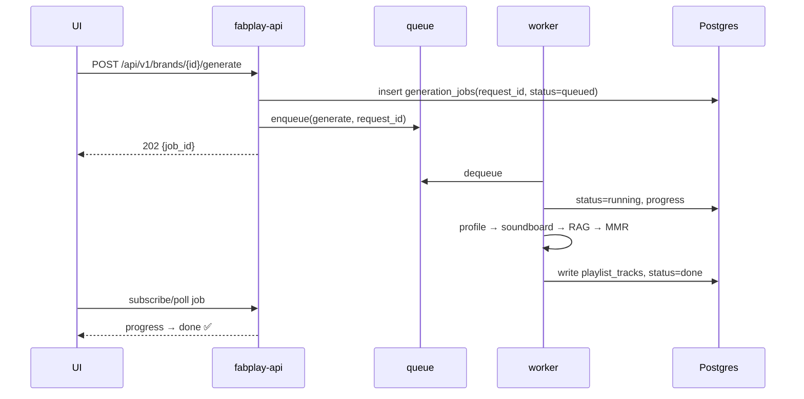

**Before → After**

| Concern | v1 today | Target |
|---|---|---|
| Errors | `return {...,"error":str(e)}` HTTP 200 (`api.py:1081`) | typed errors, correct status, structured logs |
| Catalog | reloaded per daypart/per swap (`api.py:582,1388`) | loaded once, immutable index keyed by `song_id` |
| Shared cache | mutated by MMR (`mmr_score=...`) | per-request candidate copies (fixes M-2) |
| Jobs | fire-and-forget thread | idempotent (`request_id`), retried, in `generation_jobs` |
| Reproducibility | none | seedable MMR for eval/debug |

**Why** (closes H-5, M-1, M-2): the current code hides failures (which is *why* the genre problem went unnoticed) and recomputes expensively.

---

## 6. Dependencies

**Standard**: one declared, locked, hashed, scanned set; prod image minimal; ML/ingest deps isolated.

| Item | v1 today | Target |
|---|---|---|
| Lock | pins only, no hashes | `uv`/`pip-tools` lock + hashes |
| PyMuPDF | Dockerfile-only install (H-8) | declared in requirements |
| Dev deps | `watchfiles` shipped to prod | dev/prod/worker split |
| Embedding/ML | in API image (dead) | isolated to ingest image |
| Scanning | none | Dependabot + trivy in CI |

**Why**: a production platform must build identically every time and ship a minimal, scanned surface.

---

## 7. Configuration & Secrets

**Standard**: zero plaintext secrets; managed identity → Key Vault; user requests under RLS with the anon key; service key confined to jobs; typed config validated at boot.

```mermaid
flowchart LR
    subgraph App["Container App (managed identity)"]
      API[fabplay-api]
    end
    KV[("Key Vault<br/>supabase_service_key<br/>azure_openai_key")]
    API -->|secretRef + MI| KV
    USER([User JWT]) -->|anon key| API
    API -->|"user token (RLS)"| PG[("Postgres<br/>RLS by org_id")]
    W[worker/ingest] -->|service key (trusted only)| PG
```

**Before → After**

| | v1 today (verified) | Target |
|---|---|---|
| Secret storage | inline plaintext env on Container App | Key Vault via managed identity |
| DB credential | service-role key for everything | anon key + RLS for requests; service key in worker only |
| User auth | validated with service key (`api.py:84`) | validated with anon key |
| Missing config | `sys.exit(1)` kills process (`db.py:37`) | `pydantic-settings` fails fast with a message |

**Why** (closes C-4, H-2): with 4 clients on one DB, the service-role key as the app-wide credential is one leak from total compromise; RLS makes isolation a DB guarantee.

---

## 8. Endpoints

**Standard**: versioned, consistent envelope, paginated, OpenAPI-documented, org-scoped, rate-limited. **API is internal**; only the CDN/SPA is public.

**Authorized request lifecycle**
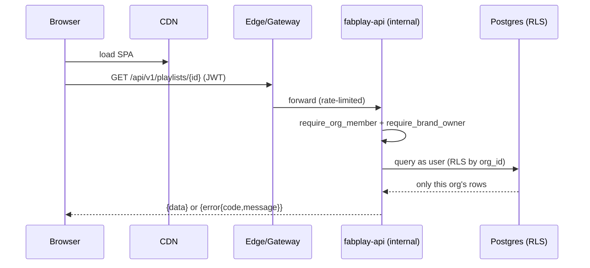

**Before → After**

| | v1 today | Target |
|---|---|---|
| Backend exposure | `external:true` (public) | internal-only; CDN/gateway public |
| Object access | JWT-only on get_playlist/generate/… (IDOR, C-3) | `require_brand_owner` + RLS |
| Media | app streams files; path traversal (C-2) | signed CloudFront URLs |
| Signup | open, auto-confirm (H-3) | rate-limited + CAPTCHA |
| Shape | `{detail}` / 200-error / bare arrays | `/api/v1`, one envelope, cursor pagination, OpenAPI |

**Why**: clients' data and the catalog must be safe from cross-tenant access and internet-facing exploits.

---

## 9. UI

**Standard**: component-based, accessible, honest about state, real-time on long ops, on a design system.

**Component tree**
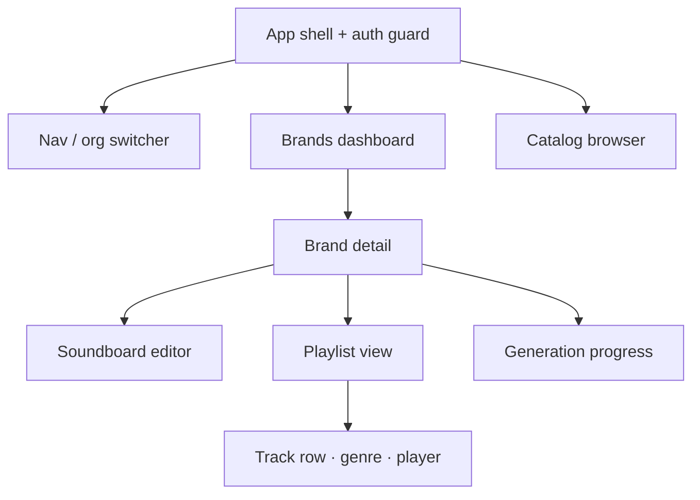

**Generation UI state machine**
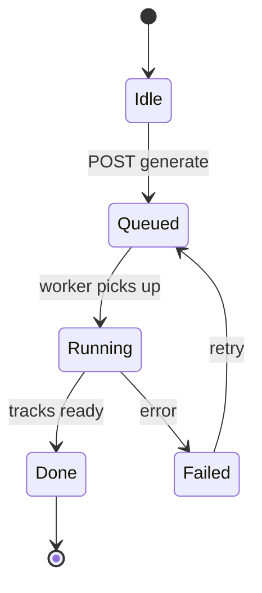

**Before → After**

| | v1 today | Target |
|---|---|---|
| Genre display | renders bad `genre`; `_fmtGenre` mutates; hides errors behind hardcoded `allGenres` | renders authoritative genre; explicit empty/error/retry |
| Long ops | unbounded polling (L-1) | Realtime subscription, progress + ETA |
| Assets | bare CDN, no SRI; `?v=NN` | self-host/SRI; content-hash filenames |
| Structure | one 1,360-line Alpine file | composable components + design system |

**Why** (closes L-1, UI half of C-1): the UI is what 4 clients touch daily; it must tell the truth and never mask failure with a default list.

---

## 10. Observability, SLOs & Operations

**Standard**: the platform reports its own health per tenant; problems surface before clients notice.

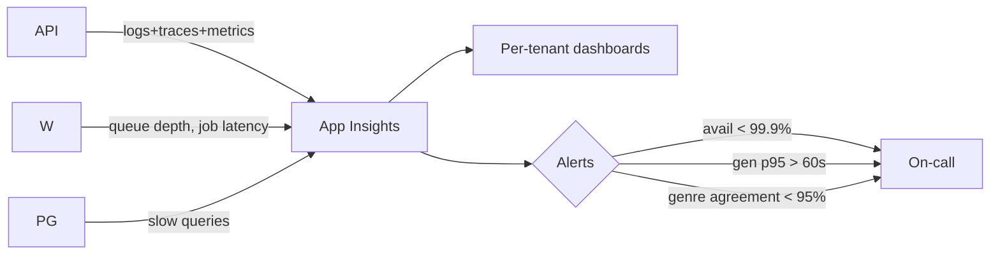

| SLO | Target | Guards against |
|---|---|---|
| API availability | ≥ 99.9% | outages |
| Read latency p95 | < 300 ms | slow dashboards |
| Generation success | ≥ 99%, p95 < 60s | stuck/failed jobs |
| **Genre data quality** | **catalog↔genre agreement ≥ 95%** | **C-1 recurring** |
| Cost | Azure OpenAI token budget / org | runaway spend |

Plus: PITR backups + tested restore, error budgets, on-call runbook. **The genre-agreement alert is the guardrail that would have caught C-1 at 94% and blocked publish.**

**Why**: 4 paying clients means commitments; you cannot meet them blind.

---

## 11. Verdict & migration roadmap

**The platform**: one stateless multi-tenant API + async worker behind a CDN; **Postgres as the single source of truth** with RLS isolating each client; a **genre system with provenance** (catalog truth, model confidence-gated, ≥95% QA gate); **secrets in Key Vault via managed identity**; **IaC + canary, probe-gated, digest-pinned deploys**; **per-tenant observability with SLOs**.

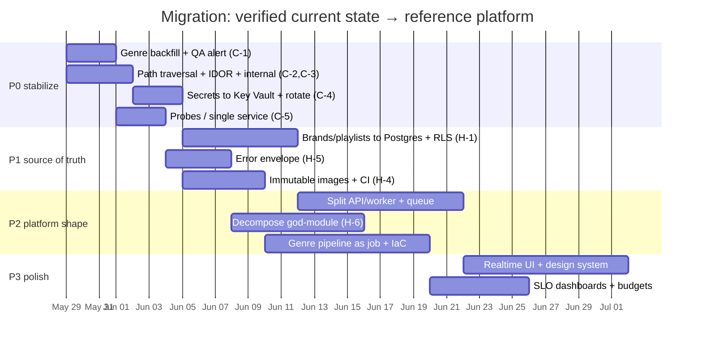

| Phase | Outcome | Key items |
|---|---|---|
| **P0 — stabilize (this week)** | Stop client-visible harm | Genre backfill (C-1) + QA alert · path traversal (C-2) · IDOR + internal backend (C-3) · secrets→Key Vault + rotate (C-4) · probes (C-5) |
| **P1 — source of truth (1-2 wks)** | No data loss, RLS isolation | Brands/playlists→Postgres (H-1) · RLS per `org_id` · migrations-as-code · error envelope (H-5) · immutable images + CI (H-4) |
| **P2 — platform shape (3-5 wks)** | Scales for more clients | API/worker + queue · god-module decomposition (H-6, M-1/M-2) · genre pipeline job (§3) · IaC + canary · lockfile/scans (§6) |
| **P3 — polish** | Client-grade UX & ops | Realtime UI · design system · SLO dashboards + budgets · signed-URL media · OpenAPI typed client |

**Strategic call**: P0's **genre backfill is the single highest-leverage action** — it fixes what every client sees today, independent of architecture, and the ≥95% agreement alert prevents recurrence. From P1 onward, the work converges v1's two-process / local-JSON foundation onto the multi-tenant, Postgres-backed, observable platform above — the version four (and more) clients can safely scale on.
