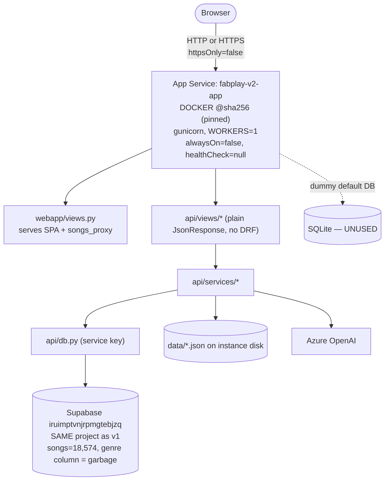
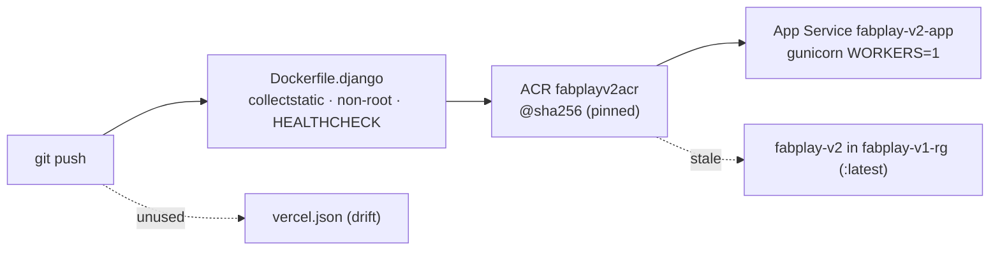
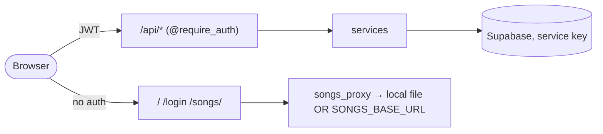

# fabplay-v2 (`django-rewrite`) — Current State (The Problems)

**Branch**: `django-rewrite` (the requester's "v2")
**Date**: 2026-05-29
**Method**: Read-only. Code read directly (branch checked out). **Live-verified** against the production Azure App Service `fabplay-v2-app` (rg `fabplay-v2`) via `az`, and the shared Supabase project `iruimptvnjrpmgtebjzq` via REST. Secrets never reproduced.
**Companion**: `TARGET_STATE.md` (how each should look).

Severity: **CRITICAL** · **HIGH** · **MEDIUM** · **LOW**. Confidence: **Confirmed** (quoted code / live data) · **Likely** · **Suspected**.

---

## 0. Live-verification corrections (read first)

A static-only read over-stated several findings. Verifying the **real** deployment (`fabplay-v2-app`) corrected them — kept here for honesty and because the *code-level* risk still exists:

| Static claim | Live reality (`az`) | Verdict |
|---|---|---|
| `DEBUG=True` in prod (Critical) | `DJANGO_DEBUG=false` is set | **Downgraded** to latent code-default risk (LOW) |
| Hardcoded `SECRET_KEY` in prod (Critical) | `DJANGO_SECRET_KEY` is set in env | **Downgraded** to latent code-default risk (LOW) |
| Startup checks dead on Vercel (High) | Deployed on **App Service gunicorn**, not Vercel → checks run | **Downgraded**: `vercel.json` is unused deploy drift |
| Two gunicorn workers race on JSON (Medium) | `GUNICORN_WORKERS=1` in prod | **Downgraded** (but multi-instance scale-out still unsafe) |

What live verification **added**: `https:false` (HTTP allowed), `healthCheck:null`, `alwaysOn:false` (cold starts), a **second stale deployment**, and confirmation the **genre data bug is identical** (same Supabase project as v1).

---

## What v2 actually is (verified topology)



Verified live: image is **digest-pinned** (`fabplayv2acr.azurecr.io/fabplay-django@sha256:aa470…`) — better than v1's `:latest`; but `httpsOnly=false`, `healthCheck=null`, `alwaysOn=false`, `GUNICORN_WORKERS=1`. A **second, stale** web app `fabplay-v2` exists in `fabplay-v1-rg` on a mutable `:latest` tag — ambiguous which is canonical.

---

## 1. Architecture

**Current state**: Plain Django (not DRF) in a single container serving the SPA *and* a JSON API. Clean-ish layering `views → services → db.py/store.py`. It is a **Django shell over Supabase**: the ORM is unused — a dummy SQLite `default` DB exists only to satisfy Django (`settings.py:96-101`), no `models.py`, no migrations. Brands/playlists persist to **instance-local JSON** (`api/store.py:7-9`) and mirror to Supabase.

**Problems**
- **[MEDIUM · Confirmed] Dual persistence with silent drift.** `data/*.json` is the brand source of truth and Supabase is a best-effort mirror whose six sync calls swallow failures (§5). Local JSON on App Service instance storage is not safe across scale-out instances. (Single worker today mitigates the *intra*-process race, not the *multi-instance* one.)
- **[MEDIUM · Confirmed] Dead scaffolding.** `fabplay/asgi.py` unused (WSGI configured); `clamp()` (`utils.py:7-8`) has no callers; the embedding/pgvector path exists but the live retriever never calls vector search; `vercel.json` is an unused deploy target.
- **[LOW · Confirmed] In-memory globals** for tasks/activity/song-cache (`tasks.py:6`, `activity.py:5`, `db.py:43-44`) are per-process — fine at 1 worker, breaks the moment App Service scales out or workers increase.

---

## 2. Pipeline & Deployment

**Current state**: One image (`Dockerfile.django`) → ACR → **App Service Web App for Containers** (`fabplay-v2-app`). The Dockerfile is genuinely good: `collectstatic` at build, a **non-root user**, and a `HEALTHCHECK` on `/api/health`.



**Problems** (live-verified)
- **[HIGH · Confirmed] `httpsOnly=false`.** App Service accepts plain **HTTP**; there is no TLS-only enforcement. Bearer tokens/credentials can traverse unencrypted. *Fix: `az webapp update --https-only true`.*
- **[HIGH · Confirmed] No health gating + cold starts.** `healthCheck=null` (App Service does not probe app health → no instance auto-recovery) and `alwaysOn=false` (the container is unloaded when idle; the next visitor pays a full cold start: Django boot + 18k-song catalog warm). The Dockerfile `HEALTHCHECK` is **not** wired to App Service's health check. *Fix: set `alwaysOn=true`, configure App Service health-check path `/api/health`.*
- **[MEDIUM · Confirmed] Two deployments, ambiguous source of truth.** `fabplay-v2-app` (digest-pinned, rg `fabplay-v2`) and a stale `fabplay-v2` (`:latest`, rg `fabplay-v1-rg`). The `:latest` one is a mutable, unmonitored liability.
- **[MEDIUM · Confirmed] No IaC / CI-CD in repo** — deploys are manual; the `:latest` second app proves drift.
- **[LOW · Confirmed] Base image `python:3.12-slim`** unpinned in the Dockerfile (the *running image* is digest-pinned at deploy, but builds aren't reproducible).
- **[GOOD]** digest-pinned running image; non-root container; sensible `.dockerignore`.

> The v1-style frontend/backend boot race does **not** exist here (single container). The deployment risks are cold-start + no health gating + HTTP-allowed, not an ordering race.

---

## 3. Data Model — including the genre system

**Current state (verified live)**: Same Supabase project as v1 (`iruimptvnjrpmgtebjzq`). `songs` = 18,574 rows; columns include `genre, genre_probabilities, mood_predicted_labels, mood_top_labels, arousal, song_type`. Brands/playlists in JSON + `brand_playlists.playlist_json`.

### ★ Genre bug — SAME data-quality root cause as v1 (CRITICAL · Confirmed against live data)

> v2 reads the same `songs.genre` column from the same project. The column is **mislabeled classifier output**; the CloudFront folder is the real genre.

Verified earlier against this exact project: JAZZ-folder tracks carry `genre='electronic'` **72%** of the time; HIP_HOP and CLASSICAL folders had **zero** correctly-labeled rows in the sample; song 67151 "Yearning" (folder JAZZ) is `genre='electronic'`, `genre_probabilities=NULL`. v2's backend faithfully returns this:
```python
# api/services/catalog_service.py:4-10  — raw passthrough, no transform
genres = sorted({song.get("genre") for song in songs if song.get("genre")})
return {"genres": genres}
```
So genre features in v2 (catalog list, include/exclude filters, must-include-genre) are built on the same bad column. **This is the headline bug and it is data, not code.**

**Problems**
- **[CRITICAL · Confirmed] `songs.genre` is unreliable** (data) — drives display *and* curation; see C-1 in v1's audit, identical project.
- **[HIGH · Confirmed] No schema-as-code** — no migrations/`models.py`; schema only in prod; ORM unused (`settings.py:96-101`).
- **[MEDIUM · Confirmed] Column typo `speechness`** read/emitted inconsistently; magic normalization constants in `db.py`.
- **[MEDIUM · Confirmed] Playlists stored as one opaque `playlist_json` blob** (+ feature-less flat list) — not relational, not queryable.

---

## 4. Code Structure

**Current state**: Decomposed into `api/views/` (8), `api/services/` (5), `api/db.py`, `auth.py`, `utils.py`, `store.py`, plus a `web/static` SPA and an `api/tests/` suite — structurally far better than a god-module.

```
fabplay/      settings · urls · wsgi · asgi(DEAD) · middleware · gunicorn.conf
api/          db auth utils store tasks activity startup urls apps
api/services/ ai(200) brand(187) catalog(55) generation(347) playlist(293)
api/views/    auth brand catalog generation health iam playlist stats
api/tests/    5 files · 776 lines
web/static/   app.js(1410) index.html(957)   ← genre bug + dead modal
```

**Problems**
- **[MEDIUM · Confirmed] `_bg_playlist` ~180 lines** (`generation_service.py:142-320`) — profile+soundboard+MMR+dedup+genre+persistence+bookkeeping in one function.
- **[MEDIUM · Confirmed] Duplicated logic**: brand authorization twice (`brand_service.py:50-56` vs `playlist_service.py:65-71`); playlist→Supabase sync twice (`generation_service.py:48-90` vs `playlist_service.py:30-62`); `_json_body` copy-pasted in 3 view files.
- **[LOW · Confirmed] Inconsistent conventions**: two service return shapes; three genre normalizations coexist; leftover `"phase": 7` marker (`health_views.py:5`).

---

## 5. Code Implementation

**Problems**
- **[HIGH · Confirmed] Dead/broken "Suggest Similar Songs" modal.** `index.html:881-952` binds to identifiers that **don't exist** in `app.js` (`pendingSuggestions`, `dismissSuggestions()`, `saveSuggestions()`, `savingSuggestions`, `sbSongType`). The documented modal flow can never open. 70 lines of dead UI, uncaught because there are **zero frontend tests**.
- **[HIGH · Confirmed] Raw exception text leaked to clients.** `generation_views.py:45,57,77`: `except Exception as exc: return err(str(exc), 500)`. (Less catastrophic now that `DEBUG=false`, but still leaks provider/internal detail.)
- **[HIGH · Confirmed] Errors masked as HTTP 200.** `catalog_service.py:8,16,54` and `iam_views.py:40,54` return `{... "error": str(exc)}` with 200 — clients can't detect failure by status.
- **[MEDIUM · Confirmed] Six silent Supabase sync swallows** (`playlist_service.py:127-289`) + `ai_service.py:185-186` — playlist mirroring can fail invisibly while the client gets `ok`.
- **[MEDIUM · Confirmed] N+1 against Azure OpenAI** — one call per uploaded file in a serial loop (`ai_service.py:155-164`); `_music_recommendations_prompt` loads the full catalog per request (`ai_service.py:87`).
- **[LOW · Confirmed] Bare swallows** in `db.py:29-30,76-83`, `utils.py:47-48`, `store.py:20-21`.

### Test coverage
- **14 test functions, 776 lines**; app code ≈ 2,631 lines → **ratio ≈ 0.29**.
- **[GOOD]** assertions are specific; no `@skip`/TODO/`assertTrue(True)`.
- **[MEDIUM · Confirmed] Plumbing-only suite.** Every algorithm is mocked: `test_generation_service.py:119-150` mocks 13 functions incl. `retrieve_candidates`/`mmr_select`; `test_playlist_service.py:145-164` mocks `compute_track_sim` to return `1.0` for the expected winner (tests its own fixture). MMR/relevance/similarity are **unexercised**; **zero frontend tests** (which is why the dead modal shipped).

---

## 6. Dependencies

**Problems**
- **[MEDIUM · Confirmed] No lockfile/hashes** — pins float transitively; not reproducible.
- **[MEDIUM · Confirmed] Embedding/ML deps in the web image** though the live retriever doesn't use them.
- **[LOW · Confirmed] No dev/prod split**; `corsheaders` etc. shipped uniformly.
- **[GOOD]** running image digest-pinned at deploy.

---

## 7. Configuration & Secrets

**Current state (verified live)**: 28 App Service app settings; `DJANGO_DEBUG=false`, `DJANGO_SECRET_KEY` set, `ALLOWED_HOSTS`/`CSRF_TRUSTED_ORIGINS` correctly scoped to the real host, `DJANGO_USE_X_FORWARDED_HOST=true`, `WEBSITES_PORT=8000`, `GUNICORN_WORKERS=1`.

**Problems**
- **[CRITICAL · Confirmed] Secrets as plaintext App Service settings.** `SUPABASE_SERVICE_KEY`, `AZURE_OPENAI_API_KEY`, `DJANGO_SECRET_KEY`, `RESEND_API_KEY` are plaintext app settings (readable via `az`), not Key Vault references. *Fix: Key Vault references + managed identity; rotate.*
- **[CRITICAL · Confirmed] Service-role (RLS-bypassing) key is the app-wide credential** (`db.py:67`, `auth.py:13`, `iam_views.py:13`, `auth_views.py:12`) and is used to validate user tokens. One leak = full DB compromise; no RLS in front of it.
- **[HIGH · Confirmed] Blanket CSRF bypass for `/api/`.** `fabplay/middleware.py:10-12` sets `_dont_enforce_csrf_checks` for any `/api/` path — path-based, not auth-scheme-based; any future cookie-authed `/api/` route is silently unprotected.
- **[LOW · Confirmed] Unsafe code defaults**: `DEBUG` defaults `True` and `SECRET_KEY` has a hardcoded fallback in `settings.py` — overridden in prod, but a landmine for any new environment.

---

## 8. Endpoints

**Current state**: `/api/*` plain `JsonResponse`, auth via `@require_auth`/`@require_superadmin` decorators; webapp routes (`/`, `/login`, `/songs/<path>`, …) unauthenticated.



**Problems**
- **[CRITICAL · Confirmed] Path traversal in unauthenticated `songs_proxy`.** `webapp/views.py:35-55` builds `Path(settings.SONGS_DIR)/path` from a `<path>` converter (local-file branch ~line 52); `../` escapes `SONGS_DIR`, guarded only by `is_file()`, route unauthenticated. *Fix: resolve + assert containment, or signed CDN URLs.*
- **[MEDIUM · Confirmed] No pagination anywhere** (hard caps: `catalog/songs` 50, `iam/users` 1000); inconsistent shapes (`{ok}` vs `{ok,day_part}` vs bare list); `/api/config` unauthenticated.
- **[MEDIUM · Confirmed] Open auto-confirmed signup** (`auth_views.py:26,58`) — unauthenticated, `email_confirm:True`, no rate limit.
- **[MEDIUM · Confirmed] Unbounded in-memory uploads** (`generation_views.py:23-27`) — no size/count cap → memory-exhaustion DoS.

---

## 9. UI

**Current state**: one Alpine.js `app()` component (`app.js` 1,410 lines); central `apiFetch()`; token + overrides in `localStorage`.

**Problems**
- **[HIGH · Confirmed] Genre rendered from bad data + hidden behind a fallback.** `_fmtGenre` (`app.js:213-216`) re-cases DB values and dedupes on the formatted string; `loadCatalogGenres` swallows errors (`catch(e){}`, `app.js:233`) and the `genres` getter falls back to a hardcoded `allGenres` (`app.js:104`). Users can't tell wrong data from a failed fetch. (Secondary to the §3 data bug.)
- **[HIGH · Confirmed] Dead suggestions modal** (see §5).
- **[MEDIUM · Confirmed] Silent UI error swallow** (`app.js:209-240`) — `/api/init` failure bounces to `/login` regardless of cause.
- **[MEDIUM · Confirmed] Unbounded polling** `_pollSb`/`_pollGen` (no max attempts).
- **[LOW · Confirmed] CDN deps without SRI; manual `?v=24` cache-bust** (`index.html:7-14,954`).
- **[GOOD]** no `console.log`/`debugger`; relative API paths; no keys in JS.

---

## 10. Verdict — current state

v2 is a **structurally sound Django reimplementation** of the same product, against the **same Supabase project** as v1 — so it inherits the **same Critical genre data bug** and the **same exploitable path traversal**, but it gets the fundamentals more right: layered code, a real (if shallow) test suite, a non-root digest-pinned container, and a single-container topology that avoids the boot race. Live verification **cleared three over-stated findings** (DEBUG/SECRET_KEY/Vercel) — but surfaced new operational gaps (`https:false`, `healthCheck:null`, `alwaysOn:false`, a stale duplicate deployment) and confirmed the **plaintext service-role key** exposure.

**Issue register (current state, live-adjusted)**

| ID | Severity | Effort | Finding | Evidence |
|----|----------|--------|---------|----------|
| C-1 | CRITICAL | M | `songs.genre` mislabeled (same project as v1) — all genre features built on it | live data §3 |
| C-2 | CRITICAL | S | Path traversal in unauth `songs_proxy` | webapp/views.py:52 |
| C-3 | CRITICAL | S | Plaintext secrets in App Service settings; service-role key app-wide + validates user tokens | az settings, db.py:67, auth.py:13 |
| H-1 | HIGH | S | `httpsOnly=false` — HTTP allowed, tokens unencrypted | az webapp |
| H-2 | HIGH | S | No App Service health check + `alwaysOn=false` (cold starts, no recovery) | az webapp |
| H-3 | HIGH | M | Dead/broken suggestions modal (undefined identifiers) | index.html:881-952 |
| H-4 | HIGH | S | Raw exception strings leaked to clients | generation_views.py:45,57,77 |
| H-5 | HIGH | S | Errors masked as HTTP 200 | catalog_service.py:8,16,54; iam_views.py:40 |
| H-6 | HIGH | S | Blanket CSRF bypass for all /api/ | middleware.py:10-12 |
| H-7 | HIGH | S | Open auto-confirmed signup, no rate limit | auth_views.py:26,58 |
| H-8 | HIGH | M | Tests mock every algorithm (plumbing-only, 0.29) | api/tests/* |
| H-9 | HIGH | S | Genre rewritten client-side + silent hardcoded fallback | app.js:213-216,104,233 |
| M-1 | MEDIUM | M | Dual JSON+Supabase persistence; unsafe on scale-out | store.py |
| M-2 | MEDIUM | M | Six silent Supabase sync swallows | playlist_service.py:127-289 |
| M-3 | MEDIUM | S | N+1 Azure calls / full-catalog per request | ai_service.py:87,155-164 |
| M-4 | MEDIUM | S | Unbounded in-memory uploads (DoS) | generation_views.py:23-27 |
| M-5 | MEDIUM | M | Two deployments (digest vs `:latest`), ambiguous canonical | az webapp list |
| M-6 | MEDIUM | S | No pagination; inconsistent shapes; `/api/config` unauth | api/views |
| M-7 | MEDIUM | S | No schema-as-code; playlists as opaque blob; ORM unused | settings.py:96 |
| M-8 | MEDIUM | S | `_bg_playlist` 180 lines; dup auth/sync/`_json_body` | services, views |
| L-1 | LOW | S | Unsafe code defaults (DEBUG=True, SECRET_KEY fallback) — overridden in prod | settings.py:26,29 |
| L-2 | LOW | S | Dead ASGI / clamp() / vercel.json drift | asgi.py, utils.py:7, vercel.json |
| L-3 | LOW | S | UI silent swallow + unbounded polling; CDN no SRI | app.js, index.html |

**3 Critical · 9 High · 8 Medium · 3 Low.** See `TARGET_STATE.md`.
