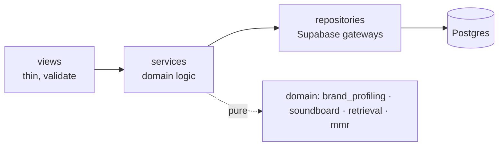
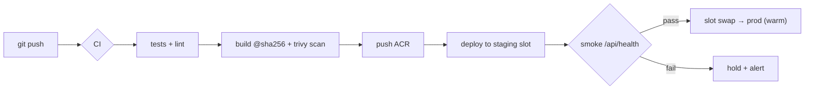
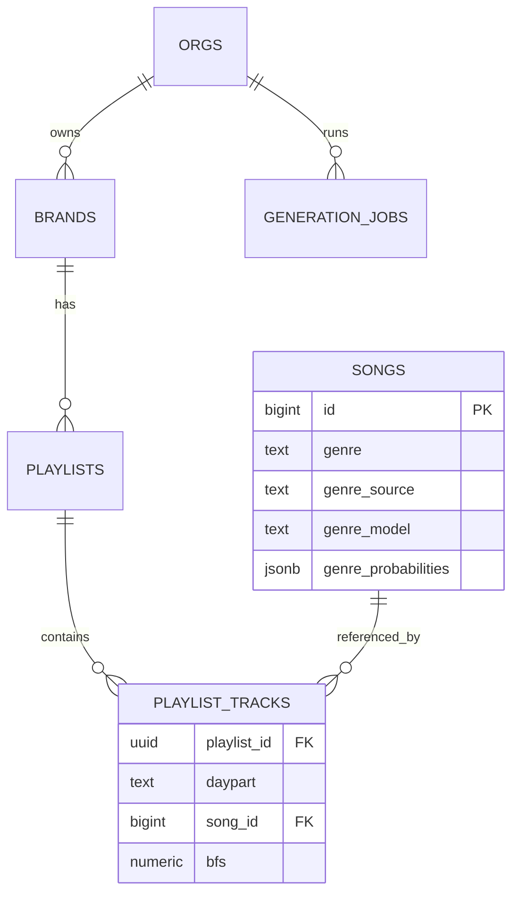
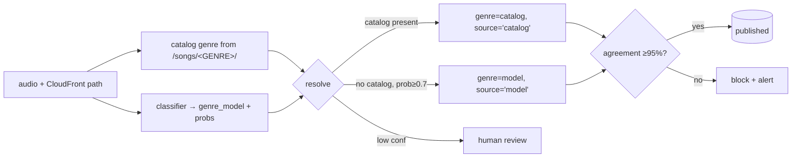
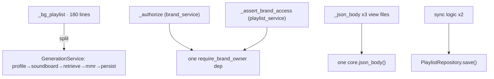
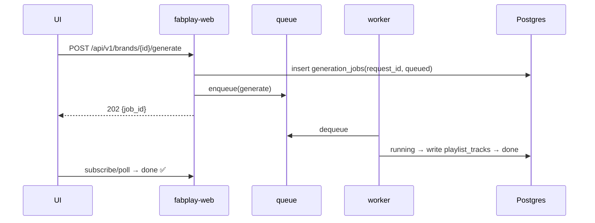
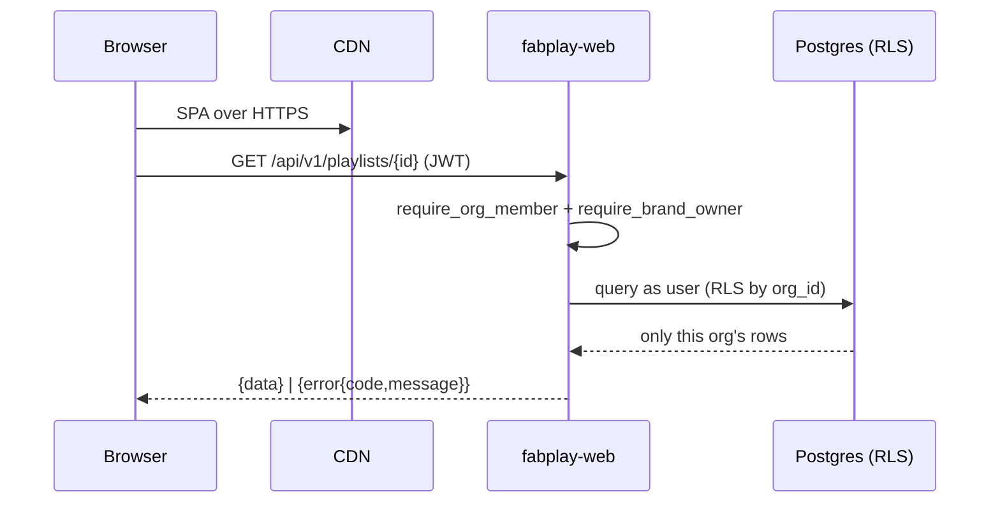
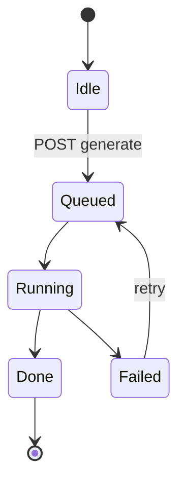
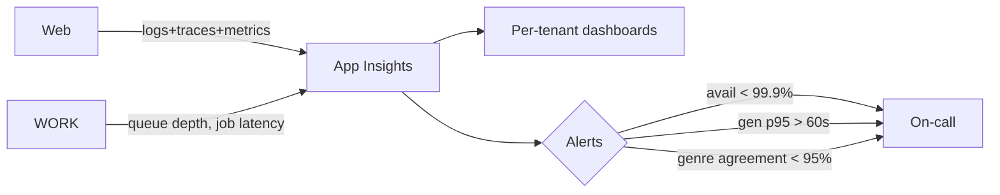
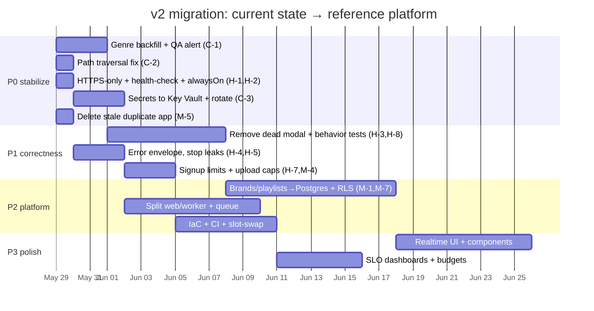

# fabplay-v2 (`django-rewrite`) — Target State (The Reference Platform)

**Scope**: the production platform v2 should be — serving real clients off the same Supabase project, on Azure App Service. v2 is the **stronger base**; this is the shorter path to the reference platform.
**Companion**: `CURRENT_STATE.md` (verified problems; IDs `C-1`…`L-3`).
**Read it as**: standard → diagram → before/after → why.

---

## What v2 already gets right (keep these)

| ✅ Already good | Evidence |
|---|---|
| Layered code (`views → services → db`) | api/services, api/views |
| Real test suite exists | api/tests · 776 lines |
| Non-root container + Dockerfile `HEALTHCHECK` | Dockerfile.django |
| **Digest-pinned** running image | `@sha256:aa470…` |
| `DEBUG=false`, scoped `ALLOWED_HOSTS`/`CSRF_TRUSTED_ORIGINS` in prod | App Service settings |
| Single container (no boot-order race) | App Service |

The target keeps all of this and closes the gaps around it.

---

## Design principles (the contract every section obeys)

| # | Principle | Forbids |
|---|-----------|---------|
| 1 | One source of truth per fact (Postgres) | JSON files, per-instance state |
| 2 | Tenant isolation in the DB (RLS) | "the view checks ownership" as the only guard |
| 3 | Least privilege; secrets in Key Vault | plaintext app settings, service key for user auth |
| 4 | Provenance over guesses (genre, features) | shipping classifier mistakes as truth |
| 5 | Closed-loop deploys (CI, health-gated, one canonical app) | manual deploys, stale duplicate apps |
| 6 | Observable by default; HTTPS-only | HTTP allowed, no health check |

---

## 0. Target topology

```mermaid
flowchart TD
    user([Client browser])
    CDN["CDN / Front Door<br/>HTTPS-only · SPA + signed audio"]
    subgraph AS["Azure App Service (or Container Apps), IaC"]
      WEB["fabplay-web (Django/gunicorn)<br/>alwaysOn=true · health-check /api/health<br/>@sha256 · WORKERS≥2"]
      WORK["fabplay-worker<br/>generation + asset analysis<br/>queue-driven, idempotent"]
    end
    PG[("Supabase Postgres<br/>orgs · brands · playlists (relational)<br/>songs + genre provenance · RLS")]
    Q[["Durable queue (pgmq / Service Bus)"]]
    KV["Key Vault (managed identity)"]
    AOAI["Azure OpenAI"]
    OBS[("App Insights")]

    user -->|HTTPS| CDN --> WEB
    user -->|/api/v1 JWT| WEB
    WEB -->|anon key + RLS| PG
    WEB -->|enqueue| Q --> WORK
    WORK -->|managed identity| PG
    WORK --> AOAI
    WEB -. secretRef .-> KV
    WORK -. secretRef .-> KV
    WEB -. logs/traces/metrics .-> OBS
    WORK -. .-> OBS
```

**Why split web/worker**: today generation + multi-file Azure OpenAI analysis run as in-process `threading.Thread` under a single gunicorn worker — they block the web dyno and die on redeploy. A queue + worker keeps the dashboard responsive and lets jobs survive deploys and scale-out.

---

## 1. Architecture

**Standard**: stateless multi-tenant Django web + async worker, Postgres-backed, CDN-fronted; keep the existing `views → services → repositories` layering and make `services/` pure/testable.



**Before → After**

| Aspect | v2 today | Target |
|---|---|---|
| State | instance-local `data/*.json` | Postgres only (stateless) |
| Heavy work | `threading.Thread`, 1 worker | durable queue + worker |
| Tenancy | `brand` ownership in view code | `org_id` + RLS in the DB |
| ORM/SQLite | dummy DB, unused ORM, dead ASGI | removed (or adopted intentionally) |
| Layering | good, but services impure | services framework-free, unit-tested |

**Why** (closes M-1, M-7, M-8, L-2): one source of truth, hard tenant boundaries for real clients, and bursty work off the request path.

---

## 2. Pipeline & Deployment

**Standard**: one canonical app, HTTPS-only, health-gated, IaC + CI; no stale duplicates.



**Before → After (live-verified)**

| | v2 today | Target |
|---|---|---|
| TLS | `httpsOnly=false` (HTTP allowed) | **HTTPS-only** (`--https-only true`) |
| Health | `healthCheck=null` | App Service health-check `/api/health` |
| Warm | `alwaysOn=false` (cold starts) | `alwaysOn=true` + warm slot-swap |
| Workers | `GUNICORN_WORKERS=1` | ≥2, autoscale rules |
| Apps | 2 deployments (digest + stale `:latest`) | one canonical app; delete the stale one |
| Release | manual | CI + **staging slot → swap** (zero-downtime, instant rollback) |
| Infra | hand-built | Bicep/Terraform, staging≡prod |
| Image | ✅ digest-pinned | keep; also pin Dockerfile base digest |

**Why** (closes H-1, H-2, M-5): real clients must get HTTPS, no cold-start failures, automatic instance recovery, and a single source-of-truth deployment with instant rollback via slot swap.

---

## 3. Data Model — including the genre system

**Standard**: relational, multi-tenant, migration-versioned, provenance on derived fields.



### ★ Genre source-of-truth — the headline fix (C-1, shared with v1)

The same Supabase `songs.genre` is mislabeled classifier output (JAZZ→"electronic" 72%). The CloudFront folder is the real genre.


```sql
alter table songs add column genre_source text, add column genre_model text;
update songs
set genre = lower(split_part(split_part(url,'/songs/',2),'/',1)), genre_source='catalog'
where url like '%/songs/%';   -- map EDM→electronic via vocab table
```

**Before → After**

| | v2 today | Target |
|---|---|---|
| `genre` | classifier garbage (shared DB) | catalog folder = truth |
| Model output | overwrites truth | `genre_model`, confidence-gated |
| Playlists | opaque `playlist_json` blob | relational `playlist_tracks`, versioned |
| Schema | only in prod; ORM unused | migrations-as-code (adopt the ORM or sqitch) |

**Why** (closes C-1, M-7): genre drives display and curation for real clients; it must be trustworthy and auditable.

---

## 4. Code Structure

**Standard**: keep the layering; make services pure; kill duplication and dead scaffolding.



**Before → After**

| | v2 today | Target |
|---|---|---|
| `_bg_playlist` | 180-line function | named pipeline steps in a service |
| Auth | two implementations | one `require_brand_owner` + RLS |
| `_json_body` | copy-pasted x3 | one `core` helper |
| Dead code | ASGI, `clamp()`, `vercel.json`, unused ORM | removed |

**Why** (closes M-8, L-2): v2's structure is good; tightening it makes domain logic testable (which is the test-suite gap, §5).

---

## 5. Code Implementation

**Standard**: correct status codes, no swallowed errors, idempotent observable jobs, behavior tests.

**Generation as a durable job**


**Before → After**

| Concern | v2 today | Target |
|---|---|---|
| Errors | `err(str(exc),500)` leak; 200-on-error | typed errors, correct status, no internal leak |
| Sync | 6 silent `except: pass` | surfaced + retried, status in `generation_jobs` |
| Jobs | `threading.Thread` | idempotent worker (`request_id`) |
| N+1 | per-file Azure calls; full-catalog/request | batched/concurrent; shared catalog index |
| Tests | mock every algorithm (0.29) | **behavior tests** for MMR/relevance/similarity + frontend smoke |
| Dead modal | 70 lines, undefined ids | removed or wired + tested |

**Why** (closes H-3, H-4, H-5, H-8, M-2, M-3): the suite proves wiring but not correctness — the dead modal shipped green. Behavior tests + honest errors are what a client-grade product needs.

---

## 6. Dependencies

| | v2 today | Target |
|---|---|---|
| Lock | pins only | `uv`/`pip-tools` lock + hashes |
| ML/embedding | in web image | isolated to worker/ingest |
| Split | one set | base/web/worker/dev |
| Scan | none | Dependabot + trivy in CI |
| Base image | unpinned in Dockerfile | digest-pinned (runtime already is) |

**Why**: reproducible, minimal, scanned — and the web image stops carrying unused ML weight.

---

## 7. Configuration & Secrets

**Standard**: secrets in Key Vault via managed identity; RLS-first auth; service key confined to the worker; safe code defaults.

```mermaid
flowchart LR
    APP["App Service (managed identity)"] -->|"Key Vault reference"| KV[("Key Vault<br/>service key · openai · django · resend")]
    USER([User JWT]) -->|anon key| APP
    APP -->|"user token"| PG[("Postgres · RLS by org_id")]
    WORK[worker] -->|service key (trusted)| PG
```

**Before → After (live-verified)**

| | v2 today | Target |
|---|---|---|
| Secret storage | plaintext App Service settings | Key Vault references + managed identity |
| DB credential | service key everywhere + validates user tokens | anon key + RLS for requests; service key in worker only |
| CSRF | blanket `/api/` bypass (path-based) | exempt by auth scheme (bearer), CSRF on cookie routes |
| Code defaults | `DEBUG=True`, `SECRET_KEY` fallback (overridden in prod) | safe defaults (`DEBUG=False`, required `SECRET_KEY`) |

**Why** (closes C-3, H-6, L-1): with real clients on one DB, the plaintext service-role key is one leak from total compromise; RLS makes isolation a DB guarantee. Rotate the currently-exposed keys.

---

## 8. Endpoints

**Standard**: versioned, consistent envelope, paginated, OpenAPI, org-scoped, rate-limited, HTTPS-only, no public file traversal.



**Before → After**

| | v2 today | Target |
|---|---|---|
| Media | `songs_proxy` path traversal (unauth) | signed CDN URLs / containment check |
| Object access | `@require_auth` only | `require_brand_owner` + RLS |
| Signup | open, auto-confirm | rate-limited + CAPTCHA |
| Uploads | unbounded in-memory | size/count caps, streamed |
| Shape | `{ok}`/bare list, no pagination | `/api/v1`, one envelope, cursor pagination, OpenAPI |

**Why** (closes C-2, M-4, M-6, H-7): client data and the catalog must be safe from traversal and cross-tenant access; consistent paginated APIs are product table stakes.

---

## 9. UI

**Standard**: component-based, accessible, honest about state, real-time on long ops.



**Before → After**

| | v2 today | Target |
|---|---|---|
| Genre | renders bad `genre`; `_fmtGenre`; hidden `allGenres` fallback | authoritative genre; explicit empty/error/retry |
| Suggestions modal | dead, undefined ids | removed or wired + tested |
| Long ops | unbounded polling | Realtime subscription + progress/ETA |
| Assets | bare CDN, no SRI; `?v=24` | self-host/SRI; content-hash filenames |
| Structure | one 1,410-line Alpine file | composable components |

**Why** (closes H-3, H-9, L-3): the UI is what clients use daily; it must render truth and never mask failure with a default list.

---

## 10. Observability, SLOs & Operations



| SLO | Target | Guards |
|---|---|---|
| API availability | ≥ 99.9% | outages, cold-start failures |
| Read p95 | < 300 ms | slow dashboards |
| Generation | ≥ 99% success, p95 < 60s | stuck jobs |
| **Genre quality** | **catalog↔genre ≥ 95%** | **C-1 recurring** |
| Cost | OpenAI budget / org | runaway spend |

Plus HTTPS-only enforcement, PITR backups + tested restore, error budgets, on-call runbook. **The genre-agreement alert blocks publish at <95% — the guardrail that would have caught C-1.**

---

## 11. Verdict & migration roadmap

**The platform**: stateless multi-tenant Django web + async worker, CDN-fronted and **HTTPS-only**, **Postgres as the single source of truth** with RLS per org, a **genre system with provenance** (catalog truth, model confidence-gated, ≥95% QA gate), **secrets in Key Vault via managed identity**, **health-gated slot-swap deploys** with one canonical app, and **per-tenant observability + SLOs**. v2 already has the layering, tests, and a clean container — the work is closing the gaps, not rebuilding.



| Phase | Outcome | Key items |
|---|---|---|
| **P0 — stabilize (this week)** | Stop client-visible harm | Genre backfill (C-1) + QA alert · path traversal (C-2) · **HTTPS-only + health-check + alwaysOn** (H-1/H-2) · secrets→Key Vault + rotate (C-3) · delete stale app (M-5) |
| **P1 — correctness (1-2 wks)** | Honest, tested behavior | Remove dead modal + behavior tests (H-3/H-8) · error envelope, no leaks (H-4/H-5) · signup limits + upload caps (H-7/M-4) · CSRF by scheme (H-6) |
| **P2 — platform (3-5 wks)** | Multi-tenant, scalable | Brands/playlists→Postgres + RLS (M-1/M-7) · split web/worker + queue · IaC + CI + slot-swap |
| **P3 — polish** | Client-grade UX & ops | Realtime UI · components · SLO dashboards + budgets · signed-URL media · OpenAPI client |

**Strategic call**: v2 is the right base — keep it. P0 is unusually cheap here because several fixes are **App Service config flips** (HTTPS-only, health-check, alwaysOn, delete the stale app) plus the shared **genre backfill (C-1)**, which is the single highest-leverage action for what clients see. From P1 onward, v2 converges on the multi-tenant, Postgres-backed, observable platform above — the version four (and more) clients can safely scale on.
